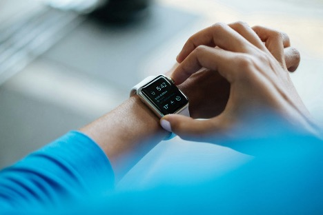
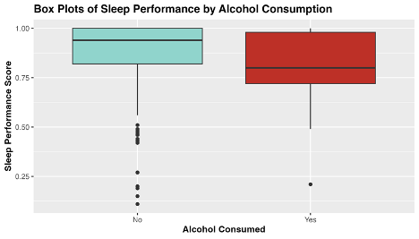
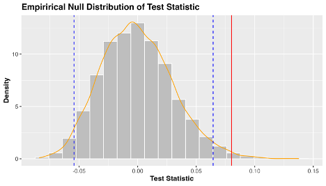

*Photo by Luke Chesser on Unsplash.*

I first heard of N-of-1 trials in 2018 as a master's student studying epidemiology. I was in my Intermediate Epidemiologic and Clinical Research Methods class, and we had a guest lecture from [Dr. Eric Daza](https://www.ericjdaza.com/) on N-of-1 study design. The N-of-1 study can be thought of as a clinical trial investigating the efficacy of an intervention on an individual patient. At the time, this methodology was an emerging practice, with promising implications for personalized medicine and optimizing healthcare for the individual.

As an aside at the end of the lecture, he mentioned that N-of-1 experiments were a hobby for some people who were obsessed with their Fitbit and familiar with statistics. These data scientists who had access to their own biometric data would conduct experiments and analyses to optimize their sleep, workouts, and diet. I was fascinated.

This lecture couldn't have come at a more perfect time. I had spent the last 5 years as a student-athlete on the women's volleyball team and was about to embark on what would become a 5 yearlong professional volleyball career. I had just started using a [Whoop](https://www.whoop.com/ca/en/) strap to track my workouts, sleep, and recovery, and had all this new data at my fingertips. I was learning statistics and study design, and now I knew how to put them to work and maybe get a leg-up in my new career.

I religiously tracked everything for the next year and a half via my Whoop, but eventually stopped wearing the device, as at the time the company didn't allow you to download your own data. Fast forward a couple years, and now I'm a Master of Data Science Student at the University of British Columbia. I'm armed with even more analytical methods, and Whoop finally lets you access your old data! Now more than ever, I can finally conduct my own N-of-1 study and answer some of the questions I had back then.

---

Before getting to the analysis, we must first define the N-of-1 study framework, and examine the historical method of conducting causal medical research.

### Randomized Clinical Trials

The gold standard of modern day medical research is the randomized clinical trial or RCT. Say we want to find out if a new drug lowers the risk of heart attacks. In an RCT, a group of patients are randomly assigned to a treatment (the drug) or control (a placebo pill). The researchers have cleverly designed this experiment so that the individuals making up the two groups have similar characteristics, such that the major difference between them is whether or not they are taking the drug. We follow these individuals for some time and take note of the heart attacks that occur. At the end of the experiment, we count up these numbers in each group, and do some statistics so that we can compare heart attack incidence between each group and whether there was a difference between the groups that was statistically significant.

RCTs are incredibly powerful tools of causal inference, and allow us to discover whether a certain intervention leads to a desired response. They are the historical backbone of applied medical research, but are somewhat limited by the importance they place on the generalizability of their results. When an RCT is conducted, the end goal is to set a new standard of practice for a wider population beyond the study participants. We make an inference on the population based on the sample, and in doing so we average out individual response. The act of doing so is almost contrary to the goal of medicine; that of caring for individual patients.

### N-of-1 Trials

N-of-1 trials address this limitation by taking RCT study design and applying it on an individual scale. They allow us to explore the variability in patient response to a given treatment, and can lead to better patient outcomes by limiting time spent on a suboptimal treatment. While the idea of an N-of-1 study has been around for some time, such studies are more accessible now because of the advancement in technology allowing for easier collection of data.

N-of-1 trials aren't always the answer to personalized medicine. In the case of fast moving maladies like infectious diseases, you likely won't have time to conduct such an individualized trial, and are better off going with a more generalized approach. For the treatment of chronic conditions however, N-of-1 trials provide an incredibly promising avenue towards the improvement of health outcomes. These conditions may not be directly life threatening, and are observable over long periods of time. This allows for multiple different interventions to be attempted, in hopes of finding an optimal treatment.

Outside of medicine, you can also apply the N-of-1 trial to your every day life. How many of us have tried a new medicine, diet, supplement, workout or sleep routine and struggled to say whether it worked? It can be hard to conclusively state whether the intervention had any effect, as most of the available evidence is anecdotal or hard to quantify. By using a N-of-1 study framework in combination with your own biometric data taken from wearable health trackers, you can get conclusive evidence that allows you to make lifestyle changes you know will make a difference.

---

### N-of-1 Trials in Practice

To show you an example of this methodology in practice, I will conduct my own analysis on a selection of data collected from my Whoop strap from April 27th, 2018 to October 5th, 2019. Our research question for this N-of-1 study is:

*Does drinking alcohol lead to poor sleep?*

As an athlete and epidemiologist, I am very aware of how detrimental alcohol can be on your sleep, athletic performance and general wellbeing. I've constantly been told how athletes should not drink, however its one thing to be told, but another to see the evidence for yourself. Once I started wearing my Whoop I noticed how my sleep score (a metric calculated by the Whoop app) would suffer after drinking alcohol. Sometimes even a day later, I thought I could still see the effect. These observations made me want to do my own analysis, which I can finally complete now.

### Notes on the Data

The two variables of interest in our analysis is sleep performance score and alcohol consumption. Sleep performance score ranges from 0 to 100 and is a metric calculated by the Whoop app from biometric data like respiratory rate, light sleep duration, slow wave sleep duration, and REM sleep duration.

The alcohol consumption variable is the response to the question "Did you have any alcoholic drinks yesterday?" that is responded to by Whoop users on a daily basis upon waking up. I always answered these questions truthfully and consistently, although we are limited in our data in that the app does not ask questions about how much alcohol was consumed. This means that all levels of alcohol consumption are treated equally, which eliminates the opportunity to analyze the relationship on a deeper level. There was some missing data in our alcohol feature, but this missing information was imputed with 'No's as I know from personal experience that if I had drunk the night before I was sure to mark it in the app.

### Exploratory Data Analysis

The first step in any analysis is to do some exploratory data analysis (EDA). This is just to get a general idea of what our data looks like, and to create a visual that will help direct our investigation.



*Fig 1. Exploratory plot of the distribution of sleep performance score by level of alcohol consumed.*

From the above box-plots, we see that average sleep score appears to be higher when no alcohol was consumed, and to have a narrower distribution. Curiously, there seems to be more outliers in sleep performance score when alcohol is not consumed. Perhaps travel days and jet-lag can account for these outliers, as I traveled overseas 5 times during this sample period.

Now that we have gotten a good first look at the data of interest, its time to dig into the statistical analysis.

### Hypothesis Testing

To answer our research question, I will be conducting hypothesis testing. Hypothesis testing is a statistical technique that allows us to make inferences about a population based on some sample data. In this case, we are attempting to infer if me drinking alcohol is associated with having poor sleep that night. We don't have data on alcohol consumption and sleep for every night I've been alive, so we study our sample data as a proxy.

The first step in hypothesis testing is to formulate my hypotheses. A 'null hypothesis' is the assumption that nothing interesting is happening or that there is no relationship or effect. In our case the **null hypothesis** is: *There is no difference in mean sleep performance between nights in which alcohol was consumed and was not consumed*.

An 'alternative hypothesis' is the hypothesis that contradicts the null, and claims that in fact there is something interesting happening. In our example the **alternative hypothesis** is: *There is a difference in mean sleep performance between nights in which alcohol was consumed and was not consumed*.

### Choosing a Statistical Test

To assess which of these hypotheses is true, we have to chose a statistical test. We are curious if the average sleep score for nights in which I drank alcohol is different from the average sleep score for nights in which I did not drink alcohol, and so will be using a difference in means to test this. Specifically, our **test statistic** is: *Mean sleep performance with no alcohol - Mean sleep performance with alcohol*.

Now that we have defined our framework, we can use R to calculate our test statistic and evaluate our hypotheses.

### Conducting our Analysis in R

From our sample data we can calculate our observed test statistic. The code in R is included below.

```r
test_stat <- data |> 
  specify(formula = sleep_performance ~ alcohol) |> 
  calculate(
    stat = "diff in means",
    order = c("No", "Yes")
  )
```

Our test statistic is 8.01. This number means that the average sleep score for nights in which I consumed no alcohol is 8.01 points higher than nights in which I did consume alcohol.

The next step in the analysis is to generate a null distribution from our sample data. A null distribution represents all the different values of test statistic we would observe if samples were drawn repeatedly from the population. The distribution is meant to reflect the variation in the test statistic purely due to random sampling. The null distribution is created in R below:

```r
set.seed(42) #Setting seed for reproducibility

null_distribution <- data |> 
  specify(formula = sleep_performance ~ alcohol) |> 
  hypothesize(null = "independence") |> 
  generate(reps = 1000, type = "permute") |> 
  calculate(
    stat = "diff in means",
    order = c("No", "Yes")
  )
```

What we are doing above is taking samples with replacement from our data, and calculating the difference in means from those samples. We do this 1000 times to generate a large enough distribution so that we can determine if our observed test statistic is significant.

After we have our null distribution and test statistic, we can calculate a two-sided p-value for an alpha of 0.05. The p-value can be thought of as the probability of getting a test statistic that is as extreme or more than our observed test statistic if the null hypothesis is true. Put into plain words; it represents how likely it would be to see this result if there was no true association. We calculate a two-sided p-value in R below, as we are interested in the possibility of the test statistic being greater or lesser than expected.

```r
p_value <- null_distribution|> 
  get_p_value(test_stat, direction = "both")
```

Our p-value is 0.017 which means that our finding is significant at the alpha=0.05 level, which is a commonly accepted level of significance in statistics. It means that the difference in sleep score we found was significant! We have the evidence to reject the null hypothesis and accept the alternative; there *is* a difference in mean sleep performance between nights in which alcohol was consumed and was not consumed.

I've included a helpful visualization of the null distribution, test statistic, and 95% quantile range below. The grey bars are the many possible test statistics calculated from our 1000 samples, and the orange line represents the density of these values. The blue dashed lines represent the 97.5th and 2.5th quantiles of this distribution, beyond which our test statistic (in red) is shown to be significant.



*Figure 2. The distribution of test statistics under the null hypothesis (no difference in mean sleep score with alcohol consumption).*

### Final Conclusions

Well, it turns out my coaches were right all along! Our analysis found that my average sleep score when I *did not* consume alcohol was 8.01 points higher than my average sleep score when I *did* consume alcohol. This difference was found to be statistically significant, with a p-value of 0.017, meaning that we reject the null hypothesis in favor of the alternative. This statistical result backs up my personal experience, giving me a quantitative result that I can have confidence in.

### Going Further

Now that I have this initial analysis under my belt, I can explore more associations in my data, and even use more complicated methods like forecasting and machine learning models.

This analysis is a very basic example of an N-of-1 study, and is not without limitations. My study was observational rather than experimental, and we cannot declare causality, as there are many other confounding variables not measured by my Whoop. If I wanted to find a causal relationship, I would have to carefully design a study, record data on all possible confounders, and find a way to blind myself to the treatment. N-of-1 studies are hard to do outside of a clinical setting, however we can still find meaningful associations and relationships by asking simple questions of our data.

I hope that after this tutorial you take the initiative to download your own data from whatever fitness tracker you can get your hands on, and play around with it. I know everyone can come up with a hypothesis about how some variable affects their health, but what most people don't realize, is that you're closer to getting a quantifiable answer to that question than you think.

### References and Further Reading

[1] Davidson, K., Cheung, K., Friel, C., & Suls, J. (2022). Introducing Data Sciences to N-of-1 Designs, Statistics, Use-Cases, the Future, and the Moniker 'N-of-1' Trial. Harvard Data Science Review, (Special Issue 3). <https://doi.org/10.1162/99608f92.116c43fe>

[2] Lillie EO, Patay B, Diamant J, Issell B, Topol EJ, Schork NJ. The n-of-1 clinical trial: the ultimate strategy for individualizing medicine? Per Med. 2011 Mar;8(2):161–173. doi: 10.2217/pme.11.7. PMID: 21695041; PMCID: PMC3118090.

[3] Daza EJ. Causal Analysis of Self-tracked Time Series Data Using a Counterfactual Framework for N-of-1 Trials. Methods Inf Med. 2018 Feb;57(1):e10-e21. doi: 10.3414/ME16–02–0044. Epub 2018 Apr 5. PMID: 29621835; PMCID: PMC6087468.

[4] Schork, N. Personalized medicine: Time for one-person trials. Nature 520, 609–611 (2015). <https://doi.org/10.1038/520609a>
