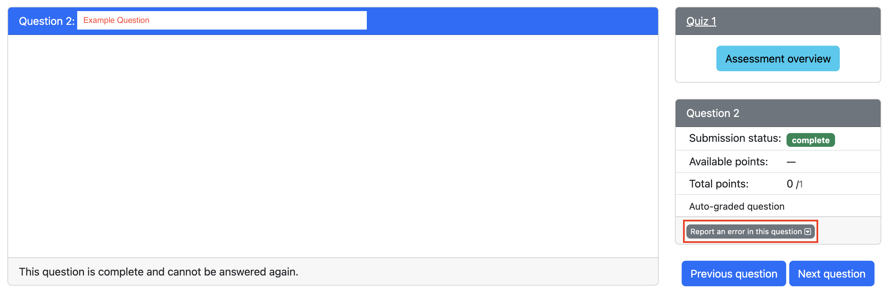
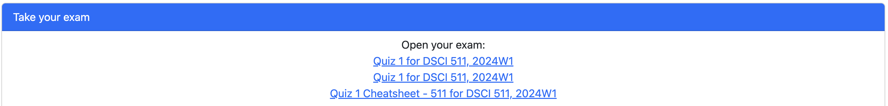
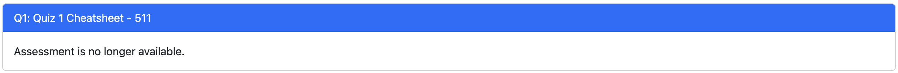
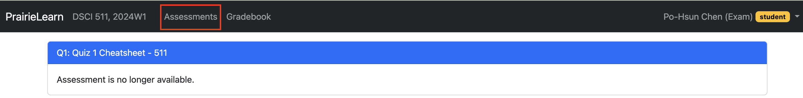
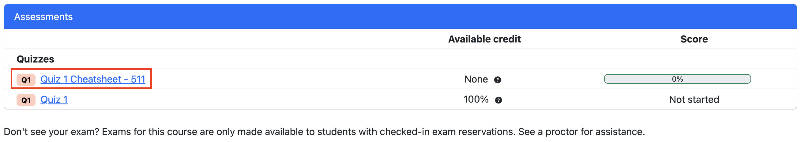
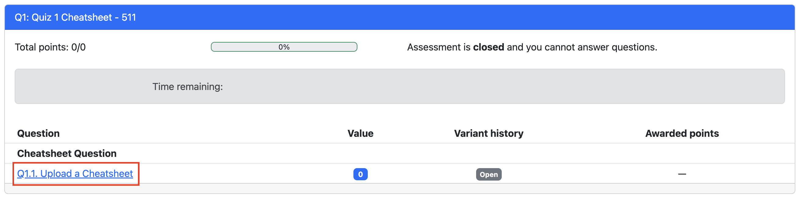
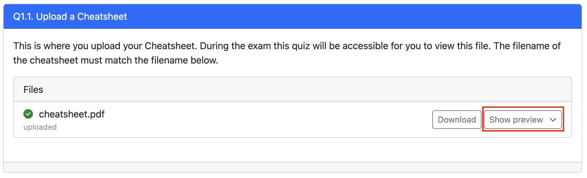

### Overview

With the exception of [project courses](https://ubc-mds.github.io/2019-08-22-project-courses/), MDS courses will have two quizzes throughout the block, typically one in the middle of the course and another after the course ends during the free days between blocks. The quizzes for a course will appear on the [MDS calendar](https://ubc-mds.github.io/calendar/) (ideally before the course starts) so that students are aware of the timing. We anticipate most quizzes being 50 minutes long.

### Purpose

The purpose of quizzes are to be a "sanity check" that students are keeping up with the essential material. While labs may go more in-depth into a topic, the quizzes cover essential material that we expect students to have mastered and to retain.

### Difficulty

In light of the purpose above, quizzes are intended to be less difficult than the labs. They are not meant to trick you nor to contain unexpected material. In short, if you did the labs without an unreasonable amount of collaboration with your classmates, you should succeed on the quizzes.

### Quiz Format and Platform

This year, quizzes will be held on PrairieLearn. Instead of quizzes being held at the same time for every student, we will provide quiz windows (available time slots) for students to register for their preferred time. Quizzes will feature randomized questions, so each student may receive a slightly different version of the quiz.

During the quiz window, students are **NOT** allowed to disclose, discuss, or share any part of the quiz with any other individual, except as directly permitted or required by the course instructors. This includes discussions in person, online, or through any electronic means. Violation of this policy will result in academic penalties, which may include failure of the quiz or failure of the course.

### Digital Cheatsheets

Students are now allowed to use digital cheatsheets, which must be uploaded to the PrairieLearn system. We trust that you will adhere to the guidelines when submitting your digital cheatsheets. Should we spot an "unreasonable" digital cheatsheet, we may request the **corresponding printed physical cheatsheet.** If it is deemed excessively unfair compared to others, penalties may be applied. The cheatsheet must be:

- **Requirements:** Confined to a **single, one-sided piece of letter-sized paper, 8.5 by 11 inches.** Please **do not** use legal or A4-sized paper
  - Letter-sized paper will be available in the labs if needed
- **Content format:** You may handwrite, type, or digitally create your cheatsheet, ensuring all information is **clearly readable when printed on letter-sized paper**
  - If you're typing your cheatsheet, ensure you use a minimum font size of 8 pt
- **Submission format:** The cheatsheet must be submitted as a **PNG file (not PDF)** with a file size of **5 MB or less.** This file size limit is enforced by PrairieLearn, not by us
  - You can create the PNG by scanning, photographing, or taking a screenshot of your cheatsheet
- **Resizing tools:** You can use Paint on Windows and Preview on Mac for basic resizing. Check out [ImageMagick](https://imagemagick.org/index.php) for more detailed adjustments such as resizing or format conversion, if needed
- **Naming convention:** File names of your digital cheatsheets should correspond with course names to avoid confusion
  - The file name for the 521 cheatsheet should be similar to `521_quiz_2_cheatsheet.png`
  - Please verify the **exact name** upon submission
- **Deadline:** digital cheatsheets are **due by 11:59 p.m.** the night before the quiz window opens
  - This is typically Monday night unless instructed otherwise
- **If a cheatsheet is found to be "unreasonable", i.e., the cheatsheet is not readable when printed on a letter-sized paper, you may be called in for a discussion and could face penalties**

Please remember that the primary goal is to understand the course material, not just to optimize your cheatsheets. Focusing on the concepts rather than the cheatsheet format will be far more beneficial for your quizzes and overall learning in the long run.

#### Instructions to Upload Cheatsheet

**Note**: Please use **Chrome** or **Firefox** to upload your cheatsheet. Other browsers may not work. If you haven’t installed these browsers, please refer to the [installation guide](https://ubc-mds.github.io/resources_pages/installation_instructions/) for instructions.

1. Log in to PrairieLearn and navigate to the course where you need to upload your cheatsheet.
2. Select the "Cheatsheet" assessment and open the corresponding upload question.
3. Upload your cheatsheet, ensuring it meets the cheatsheet [requirements](#digital-cheatsheets).
4. Click `Save & Grade` to submit your file.
5. Once uploaded, you should see a preview of your PNG on PrairieLearn. You can update and re-upload your cheatsheet as many times as needed before the deadline.

### PrairieTest and Making a Reservation for your Quiz

You must complete the instruction below before writing quizzes. This is an essential step to check in the quiz room.
- Open [PrairieTest](https://us.prairietest.com/)
- Click Login and select University of British Columbia (ubc.ca)
- Log in with your CWL
- Accept the invitation to join MDS 5XX
  - You only need to do this once, and please DM the course coordinator if you have issues viewing the invitation.
- You will be able to book quizzes and view your booked quiz times and locations, under Exam reservations.
- Follow the instructions [here](https://cbtf.ubc.ca/students/reservations) to make reservations.
- Please make reservations early, as the spots can run out

### Quiz Results Review Session

To review your quiz results, you must register for a quiz review session on PrairieTest. These sessions will typically be available one week after the quiz, once all grading has been completed. Registration for the review session will follow the same process as registering for the quiz. During the review session, you will have access to the results of all quizzes from the previous week. You may also submit regrade requests at this time by clicking on `Report an issue with this question` (to the right of the question) and describing the your regrade request.

Please note that, similar to quiz sessions, no notes or external materials are permitted during the review of your grades.

### Quiz Logistics

- You must register for a specific quiz time slot using PrairieTest. This will typically occur the week before quizzes.
- All MDS quizzes are closed-book and closed-internet, with the exception of the digital cheatsheet.
- Communication with anyone or any external resources during the quiz is strictly prohibited. For details, please visit our [Quiz policies](https://ubc-mds.github.io/policies/#quiz-policies) and [Plagiarism](https://ubc-mds.github.io/policies/#plagiarism) pages.
- You must attend your assigned quiz time and location. Failure to check in at the correct time and location may result in missing the quiz.
- When leaving the room after the quiz, please do so quietly to avoid disrupting others. Refrain from discussing the - quiz with anyone until everyone has completed it.

### Quiz Room Procedures

#### Upon arriving at the quiz room

1. Attend your booked quiz sessions.
2. Be present at least **10 minutes** before the quiz starts.
3. Upon entering the exam room, do **not** communicate with anyone other than the invigilators.
4. An invigilator will check you in. Wait until the reader displays a **red** light before tapping your student card.
5. Place all personal belongings and electronics on the racks at the front of the room (phones, bags, hats, jackets, smartwatches, etc.). Phones must be turned off or on airplane mode. Physical calculators are also not permitted (a digital one will be provided on the computer).
  - Note: Your digital cheatsheet must follow the listed requirements in the [Digital Cheatsheets](#digital-cheatsheets) section above, and scrap papers will be provided in the exam room.
6. Find your assigned seat number and log into the provided computer using the username and password displayed on the whiteboard or wall.
7. Use **Mircrosoft Edge** to open **PrairieTest**
8. Log in with your CWL. If you need Two-Factor Authentication (2FA), raise your hand and inform the invigilator.
9. Navigate to the quiz page, and wait for further instructions.
  - Ensure you open the correct quiz.

#### During the Quiz

- You will have access to your digital cheatsheet during the quiz. Open PrairieTest, where you’ll find both the quiz link and the cheatsheet link.
  - **Note**: If the cheatsheet link doesn’t work due to a known bug, you can access it by going to `Assessments` → Cheatsheet assignment.
- You have 50 minutes to complete all questions. A countdown timer will display the remaining time, and the quiz will automatically submit when the timer reaches zero.
- After submitting your exam, close your browser, hand in any scrap paper, and exit the room quietly to avoid disturbing others.

### Closed-book Policy

Unless otherwise specified, **quizzes will be closed-book** except for the digital cheatsheet. This means that during the quiz, students are expected to:

  - **Not** use the internet to solve quiz questions.
  - **Not** bring any materials that would assist in completing the quiz.
  - **Not** open any other files or webpages apart from the PrairieLearn quiz and the digital cheatsheet.
  - **Not** re-enter after leaving the quiz room (except for necessary reasons like using the washroom).

### No Collaboration

You may **not** communicate with other students or anyone else through any medium during the quiz. Communication with classmates is prohibited until all students have finished the quiz. There will be multiple quiz sessions, so please avoid discussing the quiz on Slack or elsewhere until the end of the final quiz session.

### Things to Bring/Remember

- **Student card**: Required for check-in and accessing the ICCS building after hours (after 5 pm).
- **Digital Cheatsheet**: Make sure your cheatsheet meets the [requirements](#digital-cheatsheets) and upload your digital cheatsheet to PrairieLearn before the quiz.
- **CWL password**: Memorize your password for logging into PrairieLearn.

### Special Circumstances

- **I finished the quiz early:**

  - Feel free to leave the quiz room.
  
- **I need to use the washroom:**

  - Raise your hand and notify the invigilator. Leave only if permitted. We recommend using the washroom before the quiz starts.

### How to Access your Cheatsheet During the Quiz

After you open PrairieTest, you will see three links. Two links that direct to quiz itself and one link that directs to the cheatsheet. 

#### Quiz Link

Both quiz link will work so feel free to click on either one. 

#### Cheatsheet Link

If you click on the cheatsheet link and it shows `Assessment is no longer available`. **Don't stress!**

- Click on `Assessment` on the top.

- Click on the `cheatsheet` assessment.

- Click on the `cheatsheet` question.

- Click `preview`.

- **Note**: If the preview doesn't load properly, refresh the browswer or download the cheatsheet.